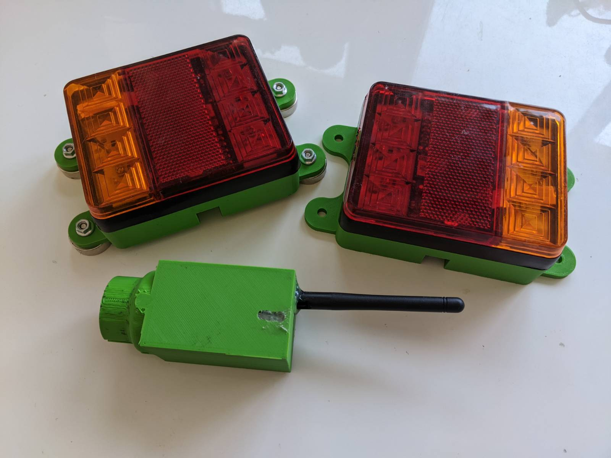
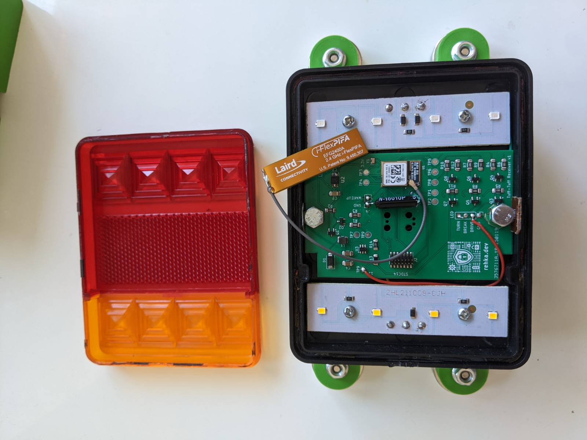
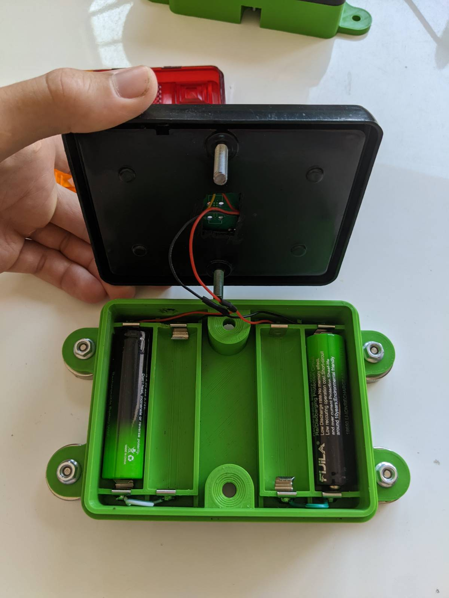
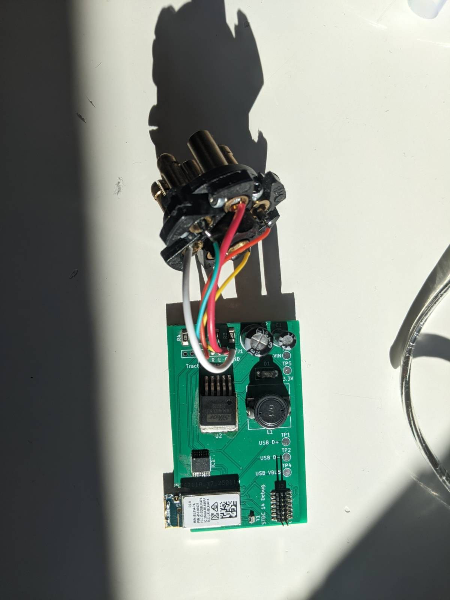

# 🚜 Wireless BLE Trailer Light System for Tractors

A robust, modular, and completely wireless trailer lighting system designed for agricultural machinery, utilizing BLE communication. 
Built on the **nRF52840 SoC** and developed with the **Zephyr RTOS**, this project includes custom-designed PCBs and 3D printed enclosures for reliable field use.
The choose design enables seamless connectivity without complicated pairing procedures and also allows to connect up to infinite receiver lights to a single sender.  






## ✨ Features

- 🔋 Battery-powered light modules (18650 x 4)
- 📡 BLE-based communication (nRF52840)
- 🔧 Built with **Zephyr RTOS**
- 🔦 Fully functional red+amber light cluster with wireless control
- 🧲 Magnetic mounting for quick install/removal
- 💻 Custom 3D printed cases and two custom-designed PCBs
- 🧠 Intelligent Power Saving (auto wakeup, no need to "switch" the light on)
---

## 📦 Project Structure
The project is structured as follows.
```
.
├── 3d/             # 3d printer files
├── applications/ 
│ ├── ttl_sender/   # ttl sender code
│ └── ttl_receiver/ # ttl receiver code
├── boards/         # custom boards definition
├── pcb/            # custom pcb KiCad files
...
└── README.md
```

---

## 🚀 Getting Started

### 🛠️ Requirements

- [Zephyr SDK](https://docs.zephyrproject.org/latest/develop/getting_started/index.html)
- [West Tool](https://docs.zephyrproject.org/latest/develop/west/index.html)
- Python 3.8+
- USB debugger (J-Link or compatible)
- Custom PCB (JLC PCB + self assembly)

### 📥 1. Clone and Initialize
First we need to initiate a python environment and install west. Afterwards, we initiate the Zephyr workspace.
```bash
python -m venv ./env
<activate venv>
pip install west
west init -m https://github.com/whati001/tuff-tuff-light tuff_tuff_light
cd tuff_tuff_light
west update
```

### 🧪 2. Build the Firmware
Navigate into the workspace directory and run:

```
# build sender
west build -b ttlv1_pa/nrf52840 ttl/applications/ttl_sender

# build receiver
west build -b ttlv1/nrf52840 ttl/applications/ttl_sender
```

### 🔌 3. Flash the Devices

Connect your debugger and run:

```
west flash
```

## 📡 System Overview

Transmitter: Reads trailer socket signals and broadcasts light commands via BLE.
Receiver Modules: Interpret BLE commands and control LEDs accordingly.

## 🧩 Hardware Details

* PCBs
  * TX Board: Reads 4-pin trailer plug input, handles BLE communication.
  * RX Board: Contains BLE radio, LED drivers, battery power management.

* Enclosures
  * All parts are printed with PLA and designed for rugged outdoor use.
  * STL/STEP files are included in the 3d/ directory.

## 🧪 Testing and Validation

The project aims just to be a minimal viable project (MVP), so there is not much testing included.

## 📃 License

This project is licensed under the MIT License. See the LICENSE file for details.

## 🤝 Contributing

Contributions are welcome! If you'd like to add features (e.g., low battery warnings, OTA updates), feel free to open a PR or issue.
If you are interested to turn this MVP into a real project, please get in touch with me. 

## 🧭 Next Steps

Here are a few ideas and enhancements planned or recommended for future development:

🔋 Battery Charging
Currently, power is restored by manually replacing the 18650 batteries. The proposed improvement is to integrate a charging circuit directly into the 3D-printed enclosure, enabling in-place recharging and eliminating the need to open the housing. At the same time, the design would retain compatibility with swappable battery modules, allowing a quick base replacement in scenarios where charging time is a limiting factor.

🚦 Expanded Signal Set
Extend support for additional signal inputs from the standard 7-pin trailer connector, including reverse, brake, fog lights, and more. Furthermore, the system’s modular architecture enables the integration of entirely new light types, such as side marker lights (e.g., white delimiting lights along the trailer’s sides), enhancing both functionality and visibility.

🌧️ Weatherproofing Enhancements
Improve gasket seals in the 3D printed case and verify IP rating in outdoor environments.

📘 Documentation Expansion
Add detailed firmware architecture docs and schematic walkthroughs.

## 📬 Contact

For questions, suggestions, or demo requests, feel free to contact [whati001@outlook.com] or open a GitHub issue

